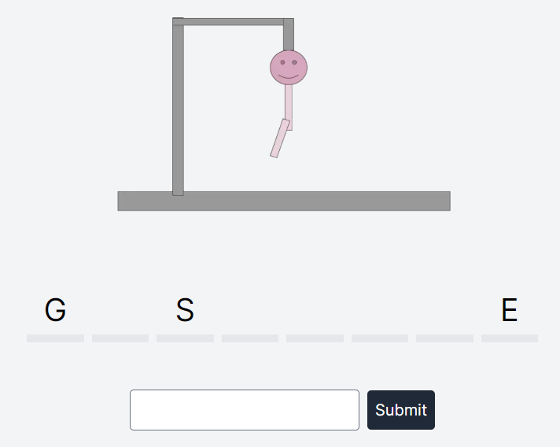
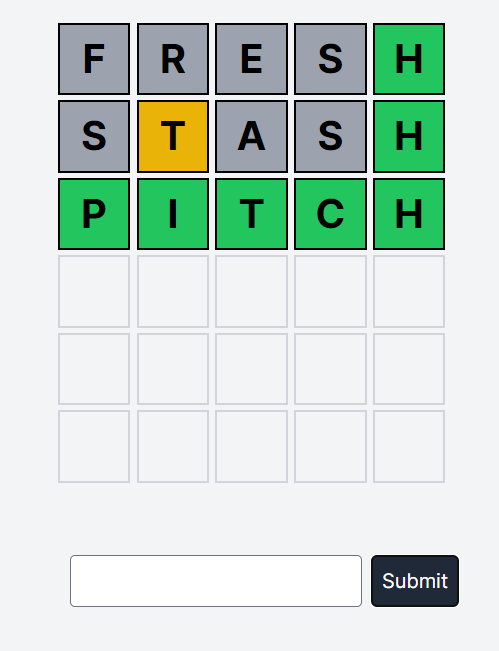

Please note that I have not linked these games in my portfolio www.samharrison.ca
It is the actual portfolio I use to send people and I do not want this there
However I have many other projects linked showing that it could be done

Project 2 for the CSI3140 class

Wordle and Hangman games

Hosted @ https://csi3140-project2.vercel.app/

# Hangman

## How to Play
Hangman is a classic word-guessing game where you try to guess the letters of a hidden word before running out of attempts. 

### Steps to Play:
1. **Start the Game:**
   - The game randomly selects a word and displays a series of underscores representing the hidden word.
   - Example: `_ _ _ _ _` (for a five-letter word)

2. **Guess a Letter:**
   - Enter a letter you think might be in the word.
   - If the letter is in the word, it replaces the corresponding underscores.
   - If the letter is not in the word, an attempt is used up and a part of the hangman figure is drawn.

3. **Win or Lose:**
   - Win by guessing all the letters in the word before running out of attempts.
   - Lose by using up all attempts before guessing the word.

### Interface:
- **Display Area:** Shows the hidden word with underscores and the correctly guessed letters.
- **Input Area:** Where you enter your letter guesses.
- **Hangman Drawing:** Graphical representation of the hangman figure that progresses with wrong guesses.

### Example Screenshot:

---

# Wordle

## How to Play
Wordle is a word puzzle game where you have six attempts to guess a five-letter word. 

### Steps to Play:
1. **Start the Game:**
   - You are presented with a grid to input your guesses.
   - Each guess must be a valid five-letter word.

2. **Make a Guess:**
   - Enter a five-letter word and press Enter.
   - The game provides feedback by coloring the letters:
     - **Green:** Correct letter in the correct position.
     - **Yellow:** Correct letter in the wrong position.
     - **Gray:** Incorrect letter.

3. **Win or Lose:**
   - Win by guessing the word within six attempts.
   - Lose if you do not guess the word in six attempts.

### Interface:
- **Board:** A 6x5 grid where each row represents a guess.
- **Input Area:** Area to input guesses.
- **Color Feedback:** Letters are colored based on accuracy to the hidden word.
- **Components:** Broken in Tile, Row, and Board components

### Example Screenshot:

---
